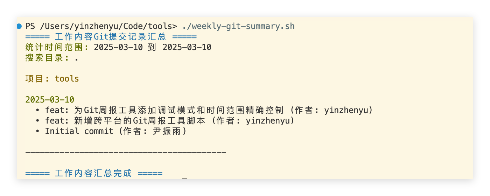
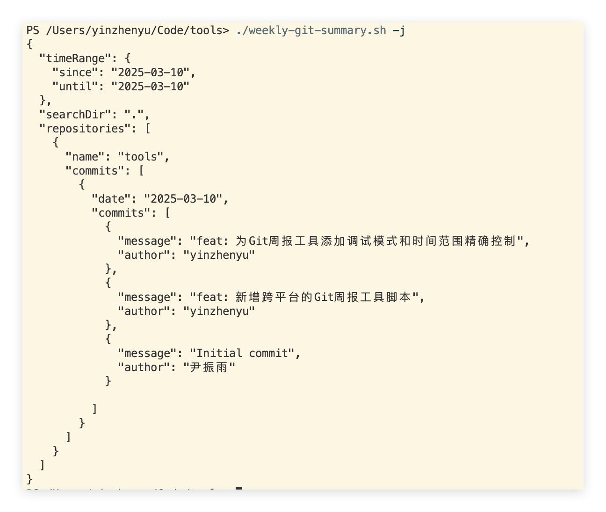

# CLI Tools and Scripts

Working scripts and tools

## weekly-git-summary.sh

Generates a summary of git commit records for the current week.

```bash
./weekly-git-summary.sh
```

## weekly-git-summary.ps1

Generates a summary of git commit records for the current week.

```powershell
.\weekly-git-summary.ps1
```

## Usage Instructions

### Parameter Description

- `-d, --dir` Specifies the directory to search, default is current directory. Supports paths with spaces, supports both quoted and backslash escaping methods.
- `-s, --since` Specifies the start date, format is `YYYY-MM-DD`, default is Monday of this week.
- `-u, --until` Specifies the end date, format is `YYYY-MM-DD`, default is today.
- `-a, --author` Specifies the author, default is all authors. Supports multiple author filtering (OR relationship), supports author names with spaces, supports both quoted and backslash escaping methods.
- `-j, --json` Outputs results in JSON format.
- `-m --md` Outputs results in Markdown format.
- `--html` Outputs results in HTML format.
- `-h, --help` Shows help information.

### Examples

- **linux/macOS**

```bash
./weekly-git-summary.sh -d ~/projects -s 2023-01-01 -u 2023-01-31

# Directory path examples - supports paths with spaces (multiple escaping methods)
./weekly-git-summary.sh -d "Program Files/MyProject"        # Quoted
./weekly-git-summary.sh --dir "My\ Documents/Projects"      # Backslash escaping within quotes
./weekly-git-summary.sh --dir "/Library/Application\ Support"  # Multiple backslash escaping

# Author filtering examples - supports multiple authors and space names (multiple escaping methods)
./weekly-git-summary.sh -a "John Doe"                      # Single author (quoted)
./weekly-git-summary.sh --author "Zhang San"               # Single author (quoted)
./weekly-git-summary.sh --author 'Li Ming Wang'            # Single author (single quoted)
./weekly-git-summary.sh -a "John\ Doe"                     # Single author (backslash escaping within quotes)
./weekly-git-summary.sh -a "Alice" -a "Bob"                # Multiple author filtering (OR relationship)
./weekly-git-summary.sh -a "John Doe" --author "Jane Smith"    # Mixed short and long parameters
./weekly-git-summary.sh -a "Dr\ John\ Doe" -a "Mary\ Jane\ Watson"  # Multiple authors with backslash escaping
```

- **windows**

```powershell
.\weekly-git-summary.ps1 -d ~/projects -s 2023-01-01 -u 2023-01-31

# Directory path examples - supports paths with spaces (multiple escaping methods)
.\weekly-git-summary.ps1 -d "C:\Program Files\MyProject"       # Quoted
.\weekly-git-summary.ps1 --dir "C:\Program\ Files\MyProject"   # Backslash escaping within quotes
.\weekly-git-summary.ps1 --dir "C:\Documents\ and\ Settings\User"  # Multiple backslash escaping

# Author filtering examples - supports multiple authors and space names (multiple escaping methods)
.\weekly-git-summary.ps1 -a "John Doe"                      # Single author (quoted)
.\weekly-git-summary.ps1 --author "Zhang San"               # Single author (quoted)
.\weekly-git-summary.ps1 --author 'Li Ming Wang'            # Single author (single quoted)
.\weekly-git-summary.ps1 -a "John\ Doe"                     # Single author (backslash escaping within quotes)
.\weekly-git-summary.ps1 -a "Alice" -a "Bob"                # Multiple author filtering (OR relationship)
.\weekly-git-summary.ps1 -a "John Doe" --author "Jane Smith"    # Mixed short and long parameters
.\weekly-git-summary.ps1 -a "Dr\ John\ Doe" -a "Mary\ Jane\ Watson"  # Multiple authors with backslash escaping
```

## Notes

- Git command line tools must be installed first.
- On Windows, you can use the `weekly-git-summary.ps1` script.
- On Windows, you need to install `git-bash` to use the `weekly-git-summary.sh` script.
- On macOS and Linux, you can use the `weekly-git-summary.sh` script.

## Screenshots






