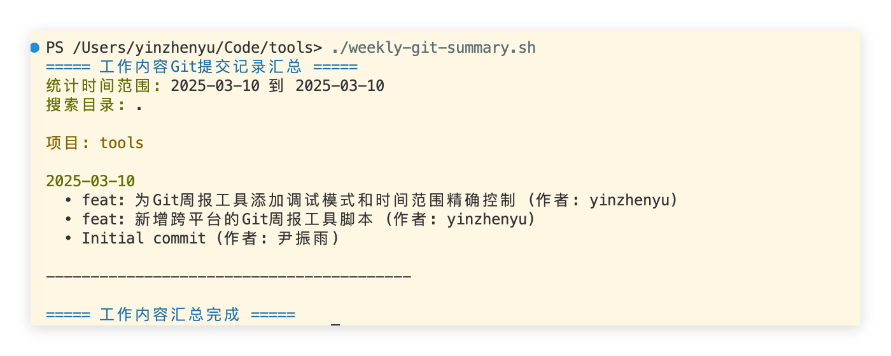
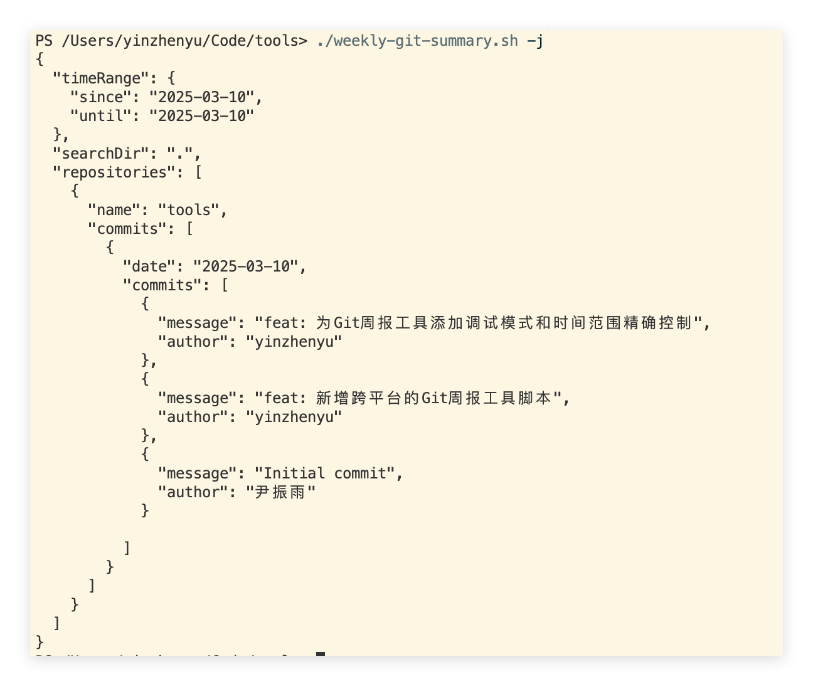

# tools

工作用脚本和工具

## weekly-git-summary.sh

生成本周 git 提交记录的总结。

```bash
./weekly-git-summary.sh
```

## weekly-git-summary.ps1

生成本周 git 提交记录的总结。

```powershell
.\weekly-git-summary.ps1
```

## 使用说明

### 参数说明

- `-d, --dir` 指定要搜索的目录，默认为当前目录。
- `-s, --since` 指定开始日期，格式为 `YYYY-MM-DD`，默认为本周一。
- `-u, --until` 指定结束日期，格式为 `YYYY-MM-DD`，默认为今天。
- `-a, --author` 指定作者，默认为所有作者。
- `-j, --json` 以 JSON 格式输出结果。
- `-m --md` 以 Markdown 格式输出结果。
- `--html` 以 HTML 格式输出结果。
- `-h, --help` 显示帮助信息。

### 示例

- **linux/macOS**

```bash
./weekly-git-summary.sh -d ~/projects -s 2023-01-01 -u 2023-01-31
```

- **windows**

```powershell
.\weekly-git-summary.ps1 -d ~/projects -s 2023-01-01 -u 2023-01-31
```

## 注意事项

- 需要先安装 git 命令行工具。
- windows 下可以使用 `weekly-git-summary.ps1` 脚本。
- windows 下需要安装 `git-bash` 才能使用 `weekly-git-summary.sh` 脚本。
- macos, linux 下可以使用 `weekly-git-summary.sh` 脚本。

## 图片




